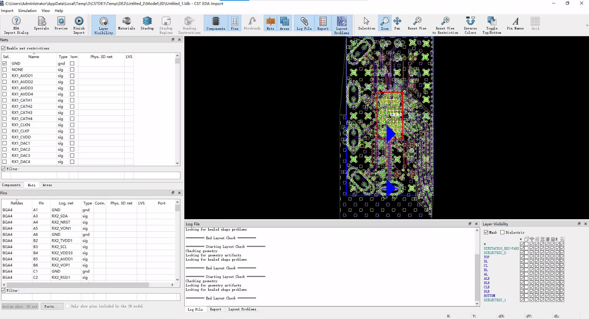
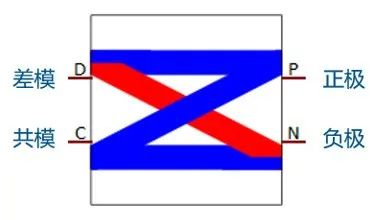

从cadence allegro封装文件中截取互连线进行电磁仿真，并进行SI分析。
同时安装cadence和allegro，并设置cst-import-eda setting-external tools -cadence的安装文件夹

1、导入allegro模型到MWS仿真。
法1：
新建PCBs工作室，import-选中allegro封装文件-导入
截取模型-import-rectangular cut-绘制区域并截取。
设置pins 可以直接转为MWS port。或者直接导出到MWS Finish import 后在MWS里设置离散port。
--设置pins：edit-terminal-添加到想仿真的端口，有些线已经有端口了，可以不用添加。
导出到微波工作室-export to MWS-选中nets-stackup 所有层全选，选中想要仿真的nets-勾选enable net restrictions 就可以只导入选中的nets。

点击ports-选中pins，添加ports。需要在导入之后检查一下端口设置，有时候会出现短路。实测该方法设置的端口问题比较大，不如自己添加。

如果在PCB工作室没有设置pins，则可以导入之后设置port，可以使用离散端口，从线端指向地平面。在PCE中切割之后再导入到MWS里可以设置平面离散端口。有可能直接导入MWS设置不出来平面离散端口，只能设置边离散端口。

然后执行仿真即可。可以右键模型-选择导入设置重新进行设置。

法2：
直接导入MWS：
新建MWS-import-EDA files-设置

根据net切割，或者矩形切割多边形切割等：net切割如下，选中nets-areas-enable。。。-automatic area from nets。在CST2024中导入整版的时候出现错误，2021可以；先导入PCB工作室，再从PCB中导入的模型没问题。然后preview-finsh就可以。建议使用第一种方法导入。

2、导入allegro模型到PCB工作室仿真S参数。
导入到PCB工作室之后，切割，设置好pins，选取nets，然后点击home-2dTL-add添加nets-选中nets下的pins
-meshing-start meshing-modeling-设置频率-update schematic。

点击到schematic视图-添加端口-task-new task-sparameters-设置Fmax为50G-点击update-即可查看S参数

3、差分S参数
差分S参数和4端口S参数是等效的，可以从单端4端口S参数直接计算，所以直接仿真4端口S参数之后，计算可以得到差分S参数。
点击schematic-macro-construct-conver signal to。。。-

S21是差模S参数，S43是共模S参数。

